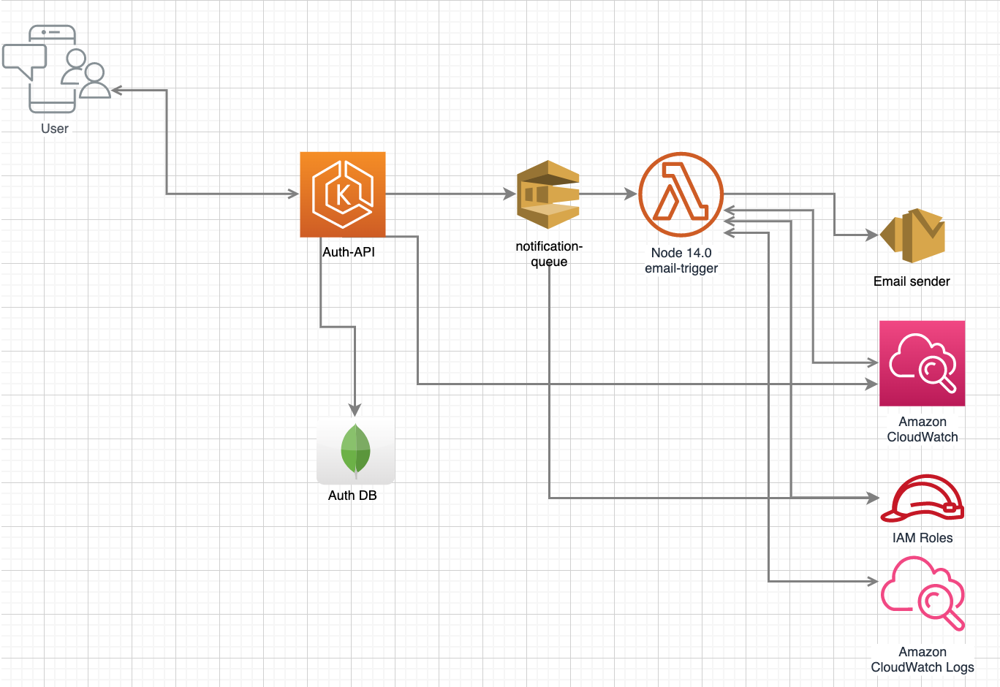

# Auth server



### Short Description:
This application is responsible for registering and authenticate
the new users from our HVM project.

### How to run the application

The application is settled to connect to the database/SMTP locally (docker) and
remote (AWS).

For both executions, it's mandatory to have aws [credentials](https://docs.aws.amazon.com/cli/latest/userguide/cli-configure-envvars.html),
in case of executing via prompt, please add the ENVIRONMENT Variables.

```
AWS_ACCESS_KEY_ID {key}
AWS_SECRET_ACCESS_KEY {secret}
AWS_DEFAULT_REGION sa-east-1
```

You can execute the docker to run all the necessary infrastructure before starting the application.

```
$ docker compose up
```

After that, feel free to start the application using the _**UserServiceApplication.kt**_

In case you're executing the application to connect to 

- MongoAtlas
- Simple email service (SES)
- Simple Queue Service (SQS)
- AWS LAMBDA

Please, get in contact within the group to get all the secrets utilized in the project.
(as a matter of security, those values won't be commited)

### Notes: 

- The simple email service (SES) does not allow sending email to real receivers without validating the domain, 
as a security mechanism to avoid spamming
- The [lambda](https://github.com/simalexan/api-lambda-send-email-ses) configured to send emails were not developed by the team, you can find the code in here, however, locally,
you can find the OTP code into the application logs to proceed with the login.


## Important topic
The secrets, to run the project connecting to the DEV environment (AWS) are at FIAP Portal


### How to debug the API
Using OTP, you'll need to access a valid email. 
to help you in the process, please fell free to use:

```
user: usuariohmv99@gmail.com
passwrod: 102030abc!
```

Here you can find the [postman collection](./AUTH-API.postman_collection.json)